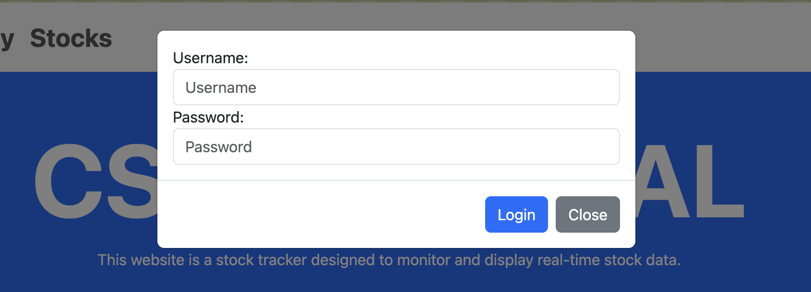
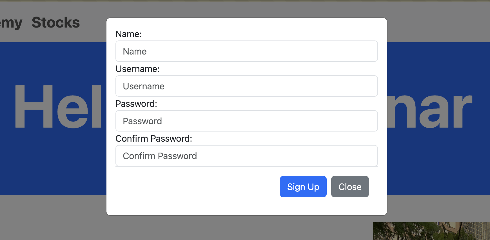

# Web Application Development Final Project - Stock Tracker

## Features
- Ability to sign up, log in, and log out.
- View stock information with dynamic visual indicators including a graph of recent closing prices.
- Add and remove stocks with a personal favorites list.
- View the changes to your favorites list in a history format.
- Fully responsive design that is compatible with mobile.

## Sign up, Log in, and Log out

  
  

