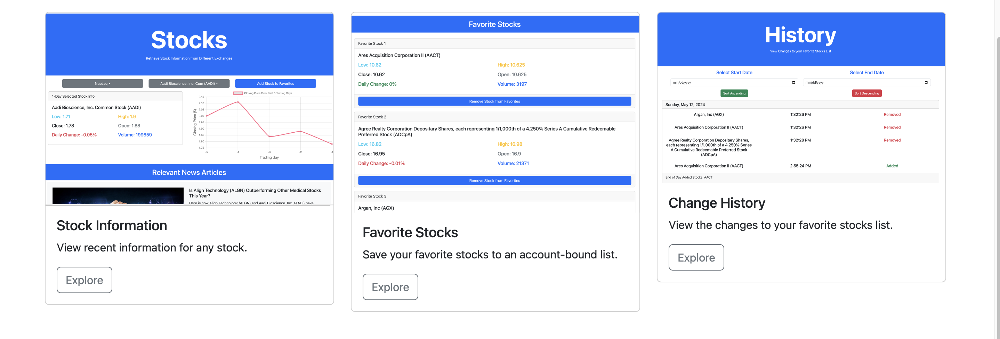

# Web Application Development Final Project - Stock Tracker

## Using Docker to Run Stock-Tracker

This project includes a Docker container setup to simplify the environment setup. To run Stock-Tracker using Docker:

1. Ensure Docker is installed on your machine. If not, download and install Docker from [Docker's website](https://www.docker.com/get-started).
2. Clone the repository to your local machine.
3. Navigate to the cloned directory.
4. Replace the API keys in script.js with your own from <a href="polygon.io">polygon.io</a>
```javascript
// Replace 'YOUR_API_KEY_HERE' with your actual API key to enable all features.
const key1 = "YOUR_API_KEY_HERE";
const key2 = "YOUR_API_KEY_HERE";
```
5. Run the following command to start the Docker container:
   
 ```sh
 docker compose up
 ```
6.	Visit http://localhost in your web browser to access the application.

## Features
- Ability to sign up, log in, and log out.
- View stock information with dynamic visual indicators including a graph of recent closing prices.
- Add and remove stocks with a personal favorites list.
- View the changes to your favorites list in a history format.
- Fully responsive design that is compatible with mobile.

## Sign up, Log in, and Log out
<table>
  <tr>
    <td></td>
    <td></td>
  </tr>
</table>

## View Stock Information, News, and Favorites List
<table>
  <tr>
    <td></td>
    <td></td>
    <td></td>
  </tr>
</table>

## View Changes to Favorites List


## Homepage
<table>
  <tr>
    <td></td>
    <td>
  </tr>
</table>

## Personal Info Page
<table>
  <tr>
    <td></td>
    <td>
  </tr>
</table>
